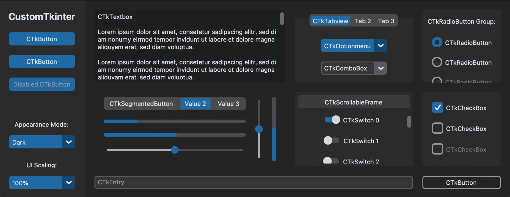

# EXEMPLO COMPLEXO DE CUSTOMTKINTER
👨‍🏫O APLICATIVO É UMA DEMONSTRAÇÃO COMPLEXA DA BIBLIOTECA CUSTOMTKINTER.

 <br>

## DESCRIÇÃO:
- O aplicativo é uma demonstração complexa da biblioteca `customtkinter`, uma extensão do Tkinter que oferece personalização avançada para interfaces gráficas em Python. 

- O aplicativo é uma GUI construída usando a biblioteca `customtkinter`, que oferece widgets personalizados e temas de cores configuráveis. Ele apresenta vários elementos interativos distribuídos em várias abas e painéis, proporcionando uma interface visual rica e customizável.

## COMPONENTES PRINCIPAIS:
1. **Barra Lateral:**
   - Contém um logotipo e botões de navegação.
   - Permite selecionar um modo de aparência (light, dark, ou system) e ajustar a escala da interface.

2. **Entrada de Texto (`CTkEntry`):**
   - Uma caixa de entrada de texto onde o usuário pode digitar informações.

3. **Botão Principal (`CTkButton`):**
   - Um botão principal com borda transparente e cores de texto personalizadas.

4. **Caixa de Texto (`CTkTextbox`):**
   - Uma área de texto para exibir conteúdo extenso.

5. **Visualizador de Abas (`CTkTabview`):**
   - Contém várias abas ("CTkTabview", "Tab 2", "Tab 3") com diferentes widgets em cada aba.
   - Inclui menus de opções e caixas de combinação.

6. **Botões de Opção e Radio (`CTkOptionMenu`, `CTkRadioButton`):**
   - Botões e seletores de opção que permitem ao usuário fazer escolhas específicas.

7. **Barras de Progresso e Controles Deslizantes (`CTkProgressBar`, `CTkSlider`):**
   - Barras de progresso horizontais e verticais, juntamente com controles deslizantes para ajuste.

8. **Quadro Rolável (`CTkScrollableFrame`):**
   - Um quadro que suporta rolagem, contendo uma grande quantidade de interruptores (`CTkSwitch`) simulados dinamicamente.

9. **Caixas de Seleção (`CTkCheckBox`):**
   - Caixas de seleção que podem ser marcadas ou desmarcadas pelo usuário.

## EXECUTANDO ESSE PROJETO:
1. Certifique-se de ter as biblioteca customtkinter instalada no seu ambiente Python. Se não tiver, você pode instalá-la usando o pip:
   ```
   pip install customtkinter
   ```

2. Para executar o arquivo Python, utilize o comando abaixo no terminal, dentro do diretório `./CODIGO`:

   ```
   python CODIGO.py
   ```

3. **Inicialização:**
   - Ao executar o script, a janela principal do aplicativo será exibida.

4. **Navegação na Barra Lateral:**
   - Use os botões na barra lateral para navegar entre diferentes seções ou funcionalidades.

5. **Configurações de Aparência e Escala:**
   - Na barra lateral, selecione um modo de aparência (`Light`, `Dark`, `System`) e uma escala de interface (`80%` a `120%`).

6. **Interagindo com Widgets:**
   - Experimente digitar na caixa de entrada de texto, clicar no botão principal, navegar entre as abas para ver diferentes widgets, selecionar opções nos menus, e ajustar controles deslizantes.

7. **Recursos Adicionais:**
   - O aplicativo também inclui funcionalidades avançadas como entrada de diálogo (`CTkInputDialog`) e feedback visual dinâmico através de barras de progresso e interruptores.

## NÃO SABE?
- Entendemos que para manipular arquivos em muitas linguagens, é necessário possuir conhecimento nessas áreas. Para auxiliar nesse aprendizado, oferecemos cursos gratuitos disponíveis:
* [CURSO DE PYTHON](https://github.com/VILHALVA/CURSO-DE-PYTHON)
* [CURSO DE CUSTOMTKINTER](https://github.com/VILHALVA/CURSO-DE-CUSTOMTKINTER)
* [CONFIRA MAIS CURSOS](https://github.com/VILHALVA?tab=repositories&q=+topic:CURSO)

## CREDITOS:
- [PROJETO CRIADO PELO "CUSTOMTKINTER"](https://github.com/TomSchimansky/CustomTkinter/blob/master/examples/complex_example.py)
- [PROJETO EDITADO PELO VILHALVA](https://github.com/VILHALVA)


